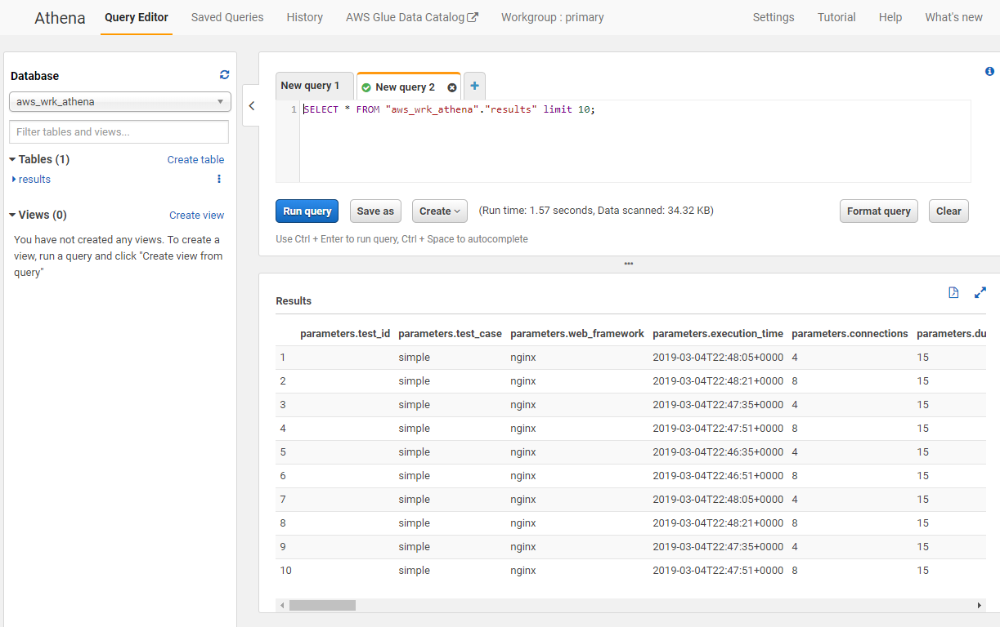
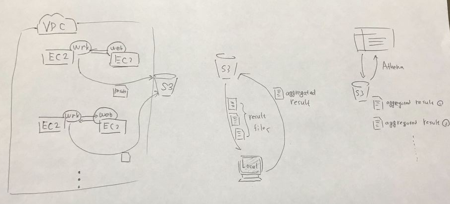

## overview

Use Amazon Athena to query wrk benchmark results saved in Amazon S3.

This is enhanced from https://github.com/richardimaoka/aws-cloudformation-wrk,
adding multiple wrk result file aggregation, and Amazon Athena capabilities.

## How-to run this

- `git clone https://github.com/richardimaoka/aws-wrk-athena.git`
- `cd aws-wrk-athena`
- Prepare a `local/local-parameters.json` file to pass in parameters to the Cloudformation EC2 stack in the next step
  - The easiest way to create it is `cp local/local-parameters.sample.json local/local-parameters.json`
- Run `./local/local-main.sh`
  - this creates a Clouformation stack with VPC components using `local/cloudformation-vpc.yaml`
  - it waits for the completion of Cloudformation stack creation, and then creates more Cloudformation stacks but this time for EC2 instances using `cloudformation-ec2.yaml`
  - once EC2 instances are ready, the script sends Amazon SSM commands to run wrk and save results to Amazon S3.
- Run `./local/local-aggregate.sh --test-exec-uuid 8275b4e4-6959-4fc9-9e8e-1534573a0480` to retrieve wrk results from S3, aggregate them and save back the aggregated file to S3
  - Replace the UUID part after `--test-exec-uuid` with the UUID printed out on your local console from the previous step
  - There is no nice way to automatically wait on completion of Amazon SSM commands, so you need to watch the SSM command status on AWS web console, and run `local/local-aggregate.sh` manually
- Now you are ready to go with Amazon Athena - Go to the Athena web console and set up the database and table with DDLs in `athena-setup.sql`. You get a result like in the attached screenshot at the top of this README.

S## Anatomy of this git repository

- `local` directory: contains shell scripts you run from your local machine
- `remote-ec2` directory: you don't run scripts in this directory, but you send Amazon SSM commands from the shell scripts under the `local directory` to execute `remote-ec2` scripts on Amazon EC2
- `athena-setup.sql`: DDL to set up Athena for this demo